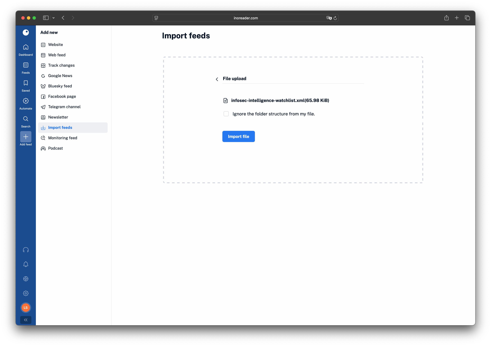
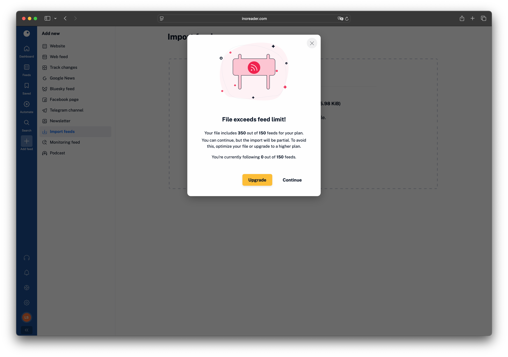
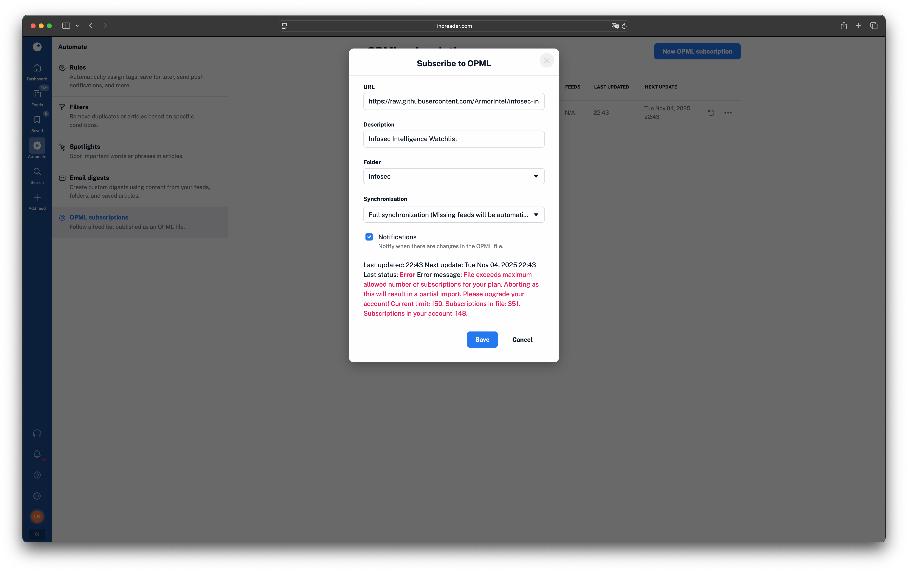
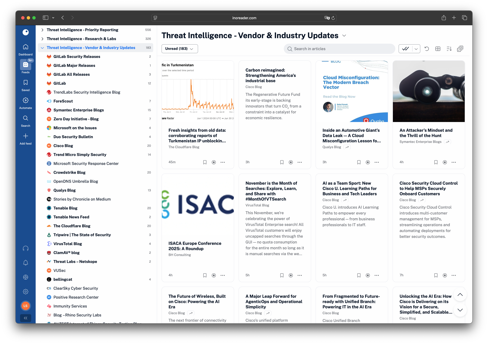
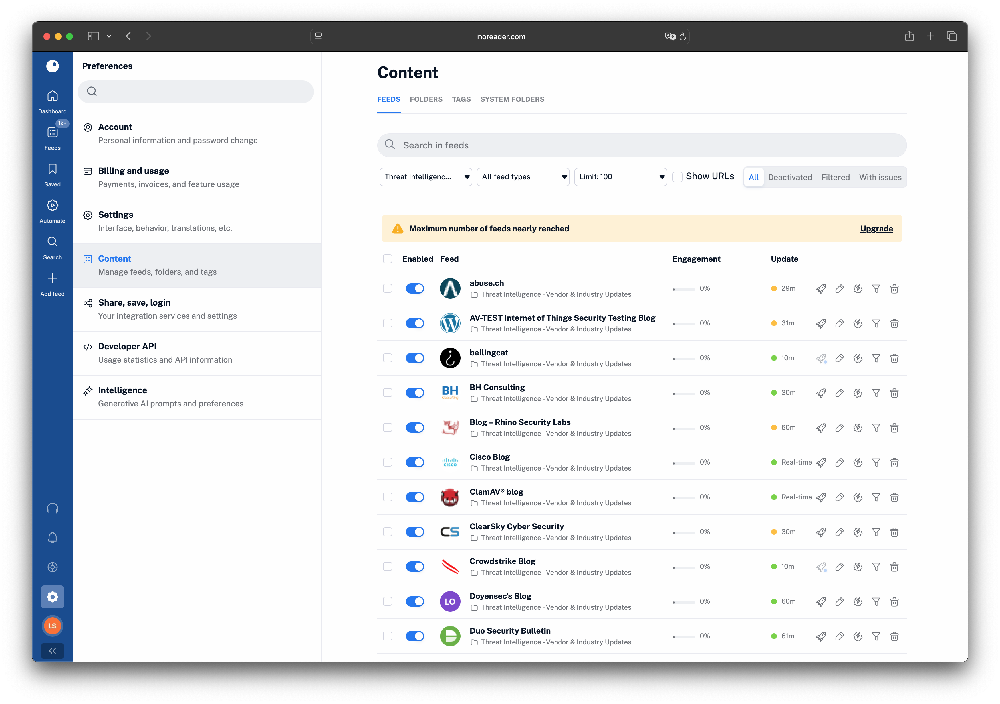
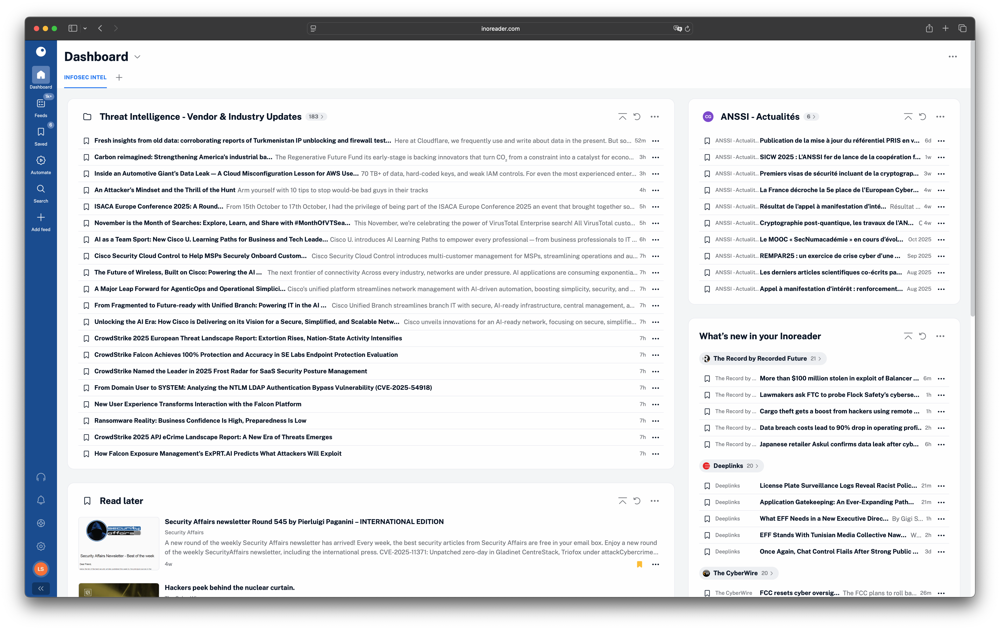

# Infosec Intelligence Watchlist

This repository contains a curated list of RSS feeds related to Cyber Threat Intelligence, Threat Hunting, and Information Security.
It consolidates high-signal RSS sources used for security monitoring, threat intelligence production, and **ongoing situational awareness**.
The list is curated for practitioners who need rapid access to advisories, research, vendor updates, and wider technology context without too much noise.

The goal is to help professionals, researchers, and enthusiasts stay up to date with the latest news, research, and discoveries in the cybersecurity landscape.

## Repository contents

- `infosec-intelligence-watchlist.xml` &mdash; is an OPML (Outline Processor Markup Language) file grouped by categories:
  - Threat Intelligence
  - Research & Labs
  - Vendor & Industry Updates
  - Government & CERT Bulletins
  - Alerts & Monitoring
  - Investigations & Breach Reporting
  - Communities & Experts
  - Knowledge Sharing & Podcasts
  - Intelligence Newsletters
  - Technology Intelligence
  - AI & Data Science
  - Privacy, Compliance & Governance
  - Cryptocurrency & Blockchain
  - Apple Ecosystem
  - Hardware & IoT
  - Software & Open Source
  - Enterprise Platforms
  - Science & Academia

## How to use the watchlist

1. Download the OPML file from this repository
2. Import the file into your RSS reader (tested with Inoreader, should be compatible with most RSS readers)
3. Review the folders, adjust notification rules, and fine-tune for your needs with filters, rules or tags in your RSS reader

### Inoreader example

#### Import feeds

There are two options, either you import all feeds and manage them, or you subscribe to the OPML file and get updates whenere it's updated.

One shot import :

Beware, if you use the free plan of Inoreader, you might be limited on the number of feeds you can import.

Subscribing to the OPML file :
You will need to use the raw file url from the xml file of this repository.
`https://raw.githubusercontent.com/ArmorIntel/infosec-intelligence-watchlist/refs/heads/main/infosec-intelligence-watchlist.xml`

#### Explore feeds

#### Manage feeds

#### Create custom dashboards

Pro tips : you can subscribe to Telegram channels, use tags, filter feeds and create automated rules (some features are in the paid plan). There is even an n8n node available, API key, etc. if you want to go further.

## Maintenance

- Check the list periodically to remove inactive feeds and add new relevant sources
- Contribute to the project, so everybody can use your new relevant sources
- When introducing new feeds, ensure they are **unique** and placed in the most relevant subcategory to preserve low noise

## Contributing

Contributions are welcome!
If you want to add new feeds or suggest improvements:
- Fork this repository
- Update the xml file
- Submit a pull request with a description

Maintained by [ArmorIntel](https://github.com/ArmorIntel/).
You can reach out for collaboration or CTI discussions.